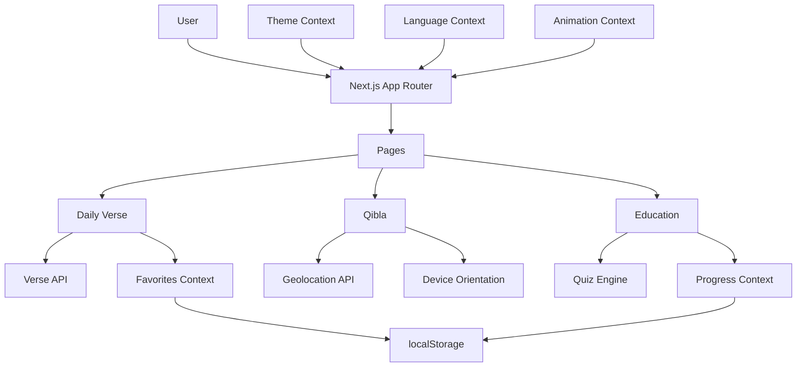

# Islamic Chatbot - Yeni Özellikler Teknik Tasarım Dokümanı

## 📋 İçindekiler
1. [Genel Bakış](#genel-bakış)
2. [Mimari Kararlar](#mimari-kararlar)
3. [Özellik Detayları](#özellik-detayları)
4. [Dosya Yapısı](#dosya-yapısı)
5. [State Management](#state-management)
6. [Animasyon Stratejisi](#animasyon-stratejisi)
7. [API Entegrasyonları](#api-entegrasyonları)
8. [Performance & Accessibility](#performance--accessibility)
9. [Implementation Planı](#implementation-planı)
10. [Gerekli Paketler](#gerekli-paketler)

---

## 🎯 Genel Bakış

### Mevcut Teknoloji Stack
- **Framework**: Next.js 15.5.14 (App Router)
- **React**: 19.2.4
- **TypeScript**: 5.x
- **Styling**: Tailwind CSS + Shadcn/ui
- **AI**: Genkit (Google Gemini)
- **State**: Context API + localStorage
- **i18n**: Custom implementation (TR/EN/AR)

### Eklenecek Özellikler
1. ✨ Günün Ayeti/Hadisi Modülü
2. 🧭 Qibla Yönü Hesaplama
3. 🎮 Eğitsel Bölüm (Quiz & Oyunlar)
4. 🎨 Gelişmiş Tema Sistemi
5. 🎬 Framer Motion Animasyonları

---

## 🏗️ Mimari Kararlar

### 1. Component Architecture
```
Atomic Design Pattern kullanılacak:
- Atoms: Button, Input, Card (mevcut)
- Molecules: VerseFavoriteButton, QiblaCompass, QuizQuestion
- Organisms: DailyVerseCard, QiblaFinder, QuizGame
- Templates: DailyVersePage, QiblaPage, EducationPage
- Pages: /daily-verse, /qibla, /education
```

### 2. State Management Strategy
```typescript
// Context API + Custom Hooks Pattern
- ThemeContext (mevcut genişletilecek)
- LanguageContext (mevcut)
- FavoritesContext (yeni)
- EducationProgressContext (yeni)
- AnimationPreferencesContext (yeni)
```

### 3. Data Flow
```
API/Static Data → Custom Hooks → Context → Components → UI
                     ↓
                localStorage (cache & persistence)
```

---

## 📦 Özellik Detayları

### 1️⃣ Günün Ayeti/Hadisi Modülü

#### Component Hierarchy
```
src/app/daily-verse/
├── page.tsx
├── components/
│   ├── daily-verse-card.tsx
│   ├── verse-actions.tsx
│   ├── verse-content.tsx
│   └── verse-skeleton.tsx
```

#### Data Structure
```typescript
interface Verse {
  id: string;
  type: 'quran' | 'hadith';
  arabic: string;
  transliteration: string;
  translation: { tr: string; en: string; ar: string; };
  reference: string;
  category?: string;
  date: string;
}
```

#### Features
- ✅ Günlük otomatik yenileme
- ✅ Favorileme (localStorage)
- ✅ Paylaşma (Web Share API)
- ✅ Kopyalama
- ✅ Kategori filtreleme

### 2️⃣ Qibla Yönü Hesaplama

#### Component Hierarchy
```
src/app/qibla/
├── page.tsx
├── components/
│   ├── qibla-compass.tsx
│   ├── compass-needle.tsx
│   ├── location-input.tsx
│   └── qibla-info.tsx
```

#### Features
- ✅ Otomatik konum algılama
- ✅ Manuel konum girişi
- ✅ Cihaz yönelimi
- ✅ Mesafe ve derece bilgisi

### 3️⃣ Eğitsel Bölüm

#### Component Hierarchy
```
src/app/education/
├── page.tsx
├── quiz/
│   ├── page.tsx
│   └── [id]/page.tsx
├── word-match/
│   └── page.tsx
└── components/
    ├── quiz-card.tsx
    ├── progress-chart.tsx
    └── achievement-badge.tsx
```

#### Features
- ✅ Çoktan seçmeli quizler
- ✅ Kelime eşleştirme oyunu
- ✅ İlerleme takibi
- ✅ Başarı rozetleri

### 4️⃣ Gelişmiş Tema Sistemi

#### Features
- ✅ Light/Dark/System mode
- ✅ Smooth transitions
- ✅ Accent color picker
- ✅ Reduced motion support

### 5️⃣ Framer Motion Animasyonlar

#### Animation Types
- Page transitions
- Card hover effects
- Staggered lists
- Compass rotation
- Islamic geometric pattern
- Micro-interactions

---

## 📁 Dosya Yapısı

```
islamic-chatbot/
├── src/
│   ├── app/
│   │   ├── daily-verse/
│   │   ├── qibla/
│   │   ├── education/
│   │   └── layout.tsx (güncelleme)
│   ├── components/
│   │   ├── islamic-pattern-background.tsx
│   │   └── theme-picker.tsx
│   ├── contexts/
│   │   ├── theme-context.tsx
│   │   ├── favorites-context.tsx
│   │   └── education-progress-context.tsx
│   ├── hooks/
│   │   ├── use-daily-verse.ts
│   │   ├── use-qibla.ts
│   │   ├── use-geolocation.ts
│   │   └── use-reduced-motion.ts
│   ├── lib/
│   │   ├── api/verses.ts
│   │   ├── qibla-calculator.ts
│   │   ├── theme-config.ts
│   │   └── animation-variants.ts
│   ├── types/
│   │   ├── verse.ts
│   │   ├── qibla.ts
│   │   └── education.ts
│   └── data/
│       ├── verses.json
│       └── quizzes.json
```

---

## 🔄 State Management

### Context Providers
```typescript
<ThemeProvider>
  <AnimationPreferencesProvider>
    <LanguageProvider>
      <FavoritesProvider>
        <EducationProgressProvider>
          {children}
        </EducationProgressProvider>
      </FavoritesProvider>
    </LanguageProvider>
  </AnimationPreferencesProvider>
</ThemeProvider>
```

### localStorage Keys
```typescript
const STORAGE_KEYS = {
  THEME: 'nurai-theme',
  FAVORITES: 'nurai-favorites',
  EDUCATION_PROGRESS: 'nurai-education-progress',
  CACHED_LOCATION: 'nurai-cached-location',
};
```

---

## 🎨 Animasyon Stratejisi

### Framer Motion Variants
```typescript
export const pageVariants = {
  initial: { opacity: 0, y: 20 },
  animate: { opacity: 1, y: 0 },
  exit: { opacity: 0, y: -20 }
};

export const cardVariants = {
  initial: { opacity: 0, scale: 0.95 },
  animate: { opacity: 1, scale: 1 },
  hover: { scale: 1.02, y: -4 },
  tap: { scale: 0.98 }
};
```

### Performance
- GPU-accelerated properties (transform, opacity)
- will-change CSS
- Reduced motion support
- AnimatePresence mode="wait"

---

## 🌐 API Entegrasyonları

### Verse API Strategy
```typescript
// Fallback chain:
1. Try API endpoint
2. Fallback to static JSON
3. Return cached verse
```

### Geolocation API
```typescript
navigator.geolocation.getCurrentPosition(
  success,
  error,
  { enableHighAccuracy: true, timeout: 10000 }
);
```

---

## ⚡ Performance & Accessibility

### Performance
- Code splitting with dynamic imports
- Image optimization
- Memoization
- Debounced operations

### Accessibility
- ARIA labels
- Keyboard navigation
- Focus management
- Screen reader support
- Reduced motion

---

## 📝 Implementation Planı

### Phase 1: Foundation
1. Framer Motion setup
2. Theme Context genişletme
3. Animation variants

**Commit**: "feat: add framer motion and enhanced theme system"

### Phase 2: Günün Ayeti/Hadisi
4. Verse types ve data
5. Favorites Context
6. Daily verse page ve components

**Commit**: "feat: implement daily verse module"

### Phase 3: Qibla Finder
7. Qibla calculator
8. Location hooks
9. Qibla page ve compass

**Commit**: "feat: implement qibla finder"

### Phase 4: Education
10. Quiz types ve data
11. Progress Context
12. Quiz pages ve components

**Commit**: "feat: implement education module"

### Phase 5: Polish
13. Islamic pattern background
14. Theme picker
15. Final animations

**Commit**: "feat: add final polish and animations"

---

## 📦 Gerekli Paketler

```bash
npm install framer-motion
```

### Paket Detayları
- **framer-motion**: ^11.0.0
  - Page transitions
  - Component animations
  - Gesture support
  - Layout animations

### Mevcut Paketler (Kullanılacak)
- lucide-react (icons)
- @radix-ui/* (UI primitives)
- tailwindcss-animate
- date-fns

---

## 🎯 Öncelik Sırası

### High Priority
1. ✅ Framer Motion kurulumu
2. ✅ Günün Ayeti/Hadisi modülü
3. ✅ Tema sistemi geliştirmeleri

### Medium Priority
4. ✅ Qibla Finder
5. ✅ Temel animasyonlar

### Low Priority
6. ✅ Eğitsel bölüm
7. ✅ İslami geometrik desen
8. ✅ Gelişmiş animasyonlar

---

## 📊 Mimari Diyagram



---

## 🔐 Güvenlik & Privacy

### Data Privacy
- Tüm veriler localStorage'da
- Konum bilgisi cache'leniyor
- API key'ler .env'de
- Kişisel veri yok

### Best Practices
- Input validation
- XSS protection
- HTTPS only
- CSP headers

---

## 🧪 Testing Strategy

### Unit Tests
- Utility functions
- Hooks
- Contexts

### Integration Tests
- Page flows
- API calls
- localStorage

### E2E Tests
- Critical user paths
- Cross-browser
- Mobile responsive

---

## 📱 Responsive Design

### Breakpoints
```css
sm: 640px   /* Mobile landscape */
md: 768px   /* Tablet */
lg: 1024px  /* Desktop */
xl: 1280px  /* Large desktop */
```

### Mobile-First
- Touch-friendly targets (44x44px)
- Swipe gestures
- Optimized animations
- Reduced data usage

---

## 🌍 i18n Güncellemeleri

### Yeni Translation Keys
```typescript
// Daily Verse
'dailyVerse.title'
'dailyVerse.favorite'
'dailyVerse.share'
'dailyVerse.copy'

// Qibla
'qibla.title'
'qibla.direction'
'qibla.distance'
'qibla.calibrate'

// Education
'education.quiz'
'education.wordMatch'
'education.progress'
'education.achievements'
```

---

## 🎨 Design System

### Colors
- Primary: Gold (Islamic theme)
- Accent: Customizable
- Background: Light/Dark modes
- Semantic: Success, Error, Warning

### Typography
- Headline: PT Sans
- Body: PT Sans
- Arabic: Lateef

### Spacing
- Base: 4px
- Scale: 4, 8, 12, 16, 24, 32, 48, 64

---

## 📈 Success Metrics

### Performance
- LCP < 2.5s
- FID < 100ms
- CLS < 0.1

### User Engagement
- Daily active users
- Feature usage
- Session duration
- Return rate

---

## 🚀 Deployment

### Vercel Configuration
```json
{
  "buildCommand": "npm run build",
  "outputDirectory": ".next",
  "framework": "nextjs"
}
```

### Environment Variables
```
NEXT_PUBLIC_API_URL=
GOOGLE_AI_API_KEY=
```

---

## 📚 Documentation

### Developer Docs
- Component API
- Hook usage
- Context providers
- Utility functions

### User Guide
- Feature tutorials
- FAQ
- Troubleshooting

---

## 🔄 Future Enhancements

### Phase 2 Features
- Backend integration
- User accounts
- Social features
- Advanced analytics
- Push notifications
- Offline mode
- PWA support

---

## ✅ Checklist

- [ ] Framer Motion kurulumu
- [ ] Theme Context genişletme
- [ ] Günün Ayeti modülü
- [ ] Qibla Finder
- [ ] Eğitsel bölüm
- [ ] Animasyonlar
- [ ] i18n güncellemeleri
- [ ] Testing
- [ ] Documentation
- [ ] Deployment

---

**Son Güncelleme**: 2026-03-30
**Versiyon**: 1.0.0
**Durum**: Tasarım Tamamlandı ✅